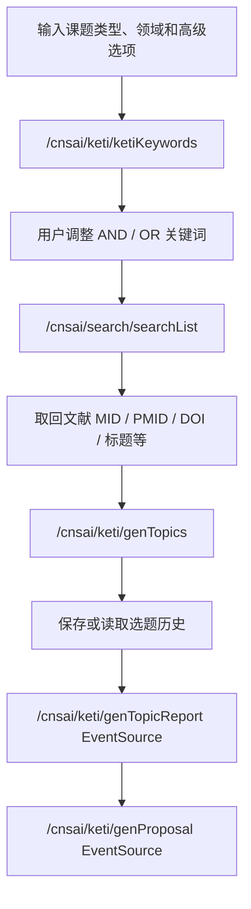

# 课题申报流程拆解与复用方案

## 结论

目标页面的业务不是一个单纯的“AI 写作”入口，而是一个从申报约束出发的课题孵化工作台。完整链路已经验证，可以复用进当前系统，但建议作为独立的 `课题申报` 模块设计，不直接塞进现有论文写作 `thesis` 流程。

推荐定位：

- 一级菜单：`课题申报`
- 前端入口：`/frontend/grant`
- 项目内五个步骤使用五个页面承载，而不是一个长页面堆叠
- 后端分组：`/api/ai/grant`
- 核心对象：`GrantProject`，不要复用 `ThesisProject`
- 复用当前系统已有的登录态、服务权限、额度扣减、AI 服务封装、Word 导出能力

## 已验证的目标网页流程

调研页面：`https://cnsai.cnsknowall.com/#/pages/cnsai/keti/keti_web`

本次实际填入并跑通的测试输入：

| 字段 | 实际值 |
| --- | --- |
| 课题类型 | 国自然-青年基金 |
| 研究领域/研究方向 | 医学科学部 / 肿瘤学 / 肿瘤免疫 |
| 申请书主题 | pd1 mediated cd8 t cell exhaustion melanoma immunotherapy resistance |
| 疾病类型/名称 | 肿瘤 / 黑色素瘤 |
| 表型/科学问题 | T细胞耗竭 |
| 主变量类型 | 膜受体 |
| 主变量名称 | pd1 |

### 1. 输入选题信息

必填：

- 课题类型：国自然-青年基金、国自然-面上项目、国自然-地区项目、省市级项目、其他
- 研究领域/研究方向：三级级联，例如 `医学科学部 / 肿瘤学 / 肿瘤免疫`

选填高级项：

- 申请书主题
- 疾病类型/名称
- 表型/科学问题
- 主变量类型
- 主变量名称

关键行为：

- 未选择课题类型或研究方向时，页面提示 `请选择课题类型、领域|研究方向!`
- 高级选项会明显改善后续主题质量；只填必填项时第三步等待时间更长且容易卡在泛化分析

### 2. 选题关键词

点击 `开始选题` 后，系统生成关键词结构。实际结果：

| 类型 | 内容 |
| --- | --- |
| 必须包含 AND | PD-1 |
| 可选 OR | 黑色素瘤、T细胞耗竭、膜受体、pd1、Melanoma、CD8+ T cell、PD-1 signaling pathway、Immune checkpoint inhibitor |

同时生成分组关键词池：

- 关联疾病
- 组织/细胞表型
- 分子靶点
- 信号通路
- 治疗方法
- 研究技术

产品含义：

- `AND` 是强约束，影响文献检索和生成主题的核心锚点。
- `OR` 是扩展召回，用户可以增删以控制选题发散范围。
- 分组关键词让用户能从疾病、表型、靶点、机制、治疗和技术六个维度调整选题方向。

### 3. 基金选题

点击 `生成创新选题` 后，页面先进行文献检索，再生成候选题目。实际等待约 60 秒。

实际生成 10 个候选题目：

1. PD-1介导的CD8+ T细胞耗竭与黑色素瘤免疫治疗耐药机制
2. 黑色素瘤中PD-1与Tim-3共表达调控CD8+ T细胞耗竭的分子机制
3. Rab37介导的PD-1膜定位在黑色素瘤T细胞耗竭中的作用
4. PD-1信号通路通过Drp1调控线粒体动力学影响CD8+ T细胞耗竭
5. PD-1hi CD8+ T细胞亚群在黑色素瘤中的异质性及其临床意义
6. PD-1阻断后肿瘤引流淋巴结中CD8+ T细胞功能重塑的机制
7. PD-1与LAG-3协同调控CD8+ T细胞耗竭在黑色素瘤中的免疫逃逸机制
8. STAT5调控PD-1转录活性影响CD8+ T细胞耗竭敏感性的机制
9. PD-1信号通路在肿瘤抗原特异性CD8+ T细胞功能衰竭中的作用
10. PD-1介导的CD8+ T细胞耗竭影响免疫检查点抑制剂安全性的机制

默认选中的第一个题目说明：

> 聚焦PD-1信号通路如何驱动黑色素瘤微环境中CD8+ T细胞功能耗竭，探究其对免疫检查点抑制剂疗效的影响及潜在逆转策略。

产品含义：

- 这一页不是简单返回标题列表，而是“文献检索 + 主题生成 + 用户选择”的决策点。
- 当前系统实现时应保存所有候选，不只保存最终选择。
- 候选题目需要支持重新生成、选择、编辑标题和查看依据。

### 4. 选题报告

点击 `生成选题报告` 后，实际等待约 60 秒。输出包含：

- 题目
- 研究方向
- 选题关键词
- 项目类型
- 一、研究目的、意义
- 二、研究内容及实现方案
- 科学问题和科学假说
- 科学假说成立的理论依据
- 选题评估
  - 创新性
  - 价值性
  - 可行性
  - 总结
- 参考文献

页面按钮：

- 重新生成选题报告
- 生成基金申请书

产品含义：

- 选题报告是申请书生成前的“立项论证层”。
- 系统中应作为独立版本保存，不能只当作临时上下文。
- 报告需要支持重新生成，并记录所依赖的选题、关键词和参考文献。

### 5. 基金申请书生成

点击 `生成基金申请书` 后，实际等待约 150 秒。输出为国自然-青年基金申请书初稿，包含：

- 中文摘要
- 关键词
- 科学问题属性选择理由
- 项目立项依据
  - 研究意义
  - 国内外研究现状及发展动态分析
  - 科学意义及应用前景
- 项目的研究内容
- 项目的研究目标
- 拟解决的关键科学问题
- 拟采取的研究方案及可行性分析
- 技术路线图
- 年度研究计划及预期研究结果
- 参考文献

实际观察到的问题：

- 正文生成成功。
- 技术路线图区域出现 Mermaid 渲染错误：`Syntax error in text`，页面显示 `mermaid version 11.12.1`。

产品含义：

- 申请书生成时间较长，必须使用流式输出或可恢复任务，不能让用户盯着单个阻塞请求。
- 图示内容要做语法校验和兜底展示。Mermaid 渲染失败时，应显示源码和错误提示，而不是破坏整份申请书阅读。

## 目标网页的隐含后端链路

从页面脚本可见，目标网页的核心链路大致如下：



已识别接口：

- `/cnsai/keti/ketiKeywords`
- `/cnsai/search/searchList`
- `/cnsai/keti/genTopics`
- `/cnsai/keti/ketiTopicsAdd`
- `/cnsai/keti/ketiTopicsList`
- `/cnsai/keti/genTopicReport`
- `/cnsai/keti/ketiReportAdd`
- `/cnsai/keti/ketiReportList`
- `/cnsai/keti/genProposal`
- `/cnsai/keti/ketiProposalAdd`
- `/cnsai/keti/ketiProposalList`
- `/cnsai/keti/genRefText`

其中报告和申请书生成使用 EventSource 流式返回。

## 当前系统复用评估

当前系统可复用部分：

| 当前能力 | 可复用方式 |
| --- | --- |
| `FrontendLayout.tsx` 菜单和懒加载路由 | 新增 `课题申报` 菜单与 `/frontend/grant` 页面 |
| `ServiceTokenGuard` / `useServiceToken` | 继续用服务令牌控制 AI 访问 |
| `TokenRecord` | 继续用于额度扣减和权限控制 |
| `ThesisProject` / `ThesisStep` 的项目-步骤模式 | 参考模式，但新建 Grant 数据表 |
| `services/ai_service.py` | 复用 OpenAI-compatible 调用封装 |
| 论文写作的保存、步骤流转、导出经验 | 复用产品模式，不复用业务实体 |

不建议直接复用部分：

| 不建议项 | 原因 |
| --- | --- |
| `ThesisProject` | 论文写作与课题申报字段、生命周期、导出结构不同 |
| `ThesisStep` 枚举 | 课题申报需要 input/keywords/topics/report/proposal/reference/export |
| 一次性长文本生成接口 | 申请书生成可能超过 2 分钟，需要流式或后台任务 |
| 纯 AI 生成主题 | 目标网页先做文献检索再生成，选题质量依赖参考文献 |

## 页面结构建议

五个步骤建议拆成五个页面。原因是每一步都有不同的主任务、生成耗时、数据结构和失败恢复方式，如果放在一个页面，会导致用户不清楚当前是在“填条件”“调关键词”“选题决策”还是“写申请书”。

推荐路由：

```text
/frontend/grant
/frontend/grant/projects/{project_id}/input
/frontend/grant/projects/{project_id}/keywords
/frontend/grant/projects/{project_id}/topics
/frontend/grant/projects/{project_id}/report
/frontend/grant/projects/{project_id}/proposal
```

页面职责：

| 页面 | 主任务 | 关键操作 |
| --- | --- | --- |
| 输入选题信息页 | 收集申报约束和高级条件 | 保存草稿、开始选题 |
| 选题关键词页 | 审核 AND/OR 关键词和六类关键词池 | 增删关键词、重新生成、生成创新选题 |
| 基金选题页 | 对比候选题并选择一个方向 | 选择题目、编辑题目、重新生成、生成选题报告 |
| 选题报告页 | 阅读和确认立项论证 | 重新生成报告、编辑局部、生成申请书 |
| 基金申请书页 | 分章节生成和修订申请书 | 逐章重写、修订、导出 Word |

每个页面都应保留一个统一的项目头部：

- 当前项目标题或暂定题目
- 课题类型
- 研究方向
- 5 步进度导航
- 保存状态
- 额度消耗提示

## 建议产品架构

### 前端目录

```text
frontend/src/pages/grant/
  GrantProjectLayout.tsx
  GrantProjectListPage.tsx
  GrantInputPage.tsx
  GrantKeywordsPage.tsx
  GrantTopicsPage.tsx
  GrantReportPage.tsx
  GrantProposalPage.tsx
  components/
    GrantProgressNav.tsx
    GrantProjectHeader.tsx
    GrantReferencePanel.tsx
    GrantVersionDrawer.tsx
  hooks/
    useGrantWorkflow.ts
  grantTypes.ts
  grantApi.ts
```

### 前端状态机

```ts
type GrantStepKey =
  | 'input'
  | 'keywords'
  | 'topics'
  | 'report'
  | 'proposal';

interface GrantWorkflowState {
  projectId?: number;
  currentStep: GrantStepKey;
  input: GrantTopicInput;
  keywords?: GrantKeywordResult;
  references: GrantReference[];
  topics: GrantCandidateTopic[];
  selectedTopicId?: string;
  report?: GrantTopicReport;
  proposal?: GrantProposalDraft;
  generationStatus: 'idle' | 'running' | 'ready' | 'failed';
}
```

### 后端目录

```text
api/grant.py
schemas/grant.py
services/grant_service.py
services/grant_prompts.py
services/literature_search_service.py
```

### 数据模型

```text
grant_projects
  id
  user_id
  service_token_id
  fund_type
  research_area_path
  subject
  disease_path
  phenotype
  variable_type
  variable_name
  current_step
  created_at
  updated_at

grant_steps
  id
  project_id
  step_key
  status
  input_json
  output_json
  raw_text
  error_message
  created_at

grant_topics
  id
  project_id
  title
  description
  score_json
  selected

grant_references
  id
  project_id
  pmid
  doi
  title
  journal
  year
  authors_json
  source_json

grant_exports
  id
  project_id
  export_type
  file_path
  created_at
```

### API 设计

```text
POST /api/ai/grant/projects
GET  /api/ai/grant/projects
GET  /api/ai/grant/projects/{project_id}
PATCH /api/ai/grant/projects/{project_id}

POST /api/ai/grant/projects/{project_id}/keywords
POST /api/ai/grant/projects/{project_id}/references/search
POST /api/ai/grant/projects/{project_id}/topics
POST /api/ai/grant/projects/{project_id}/report
POST /api/ai/grant/projects/{project_id}/proposal
POST /api/ai/grant/projects/{project_id}/proposal/sections/{section_key}/regenerate
POST /api/ai/grant/projects/{project_id}/exports/word
```

报告和申请书建议优先做流式：

```text
GET /api/ai/grant/projects/{project_id}/report/stream
GET /api/ai/grant/projects/{project_id}/proposal/stream
```

如果当前前后端暂时不方便接 SSE，可以先用后台任务：

```text
POST /api/ai/grant/projects/{project_id}/jobs
GET  /api/ai/grant/jobs/{job_id}
```

## AI 生成阶段拆分

不要一次把“选题、报告、申请书”塞给一个提示词。建议拆成 5 个可审计阶段：

1. `expand_keywords`
   - 输入：基金类型、研究方向、高级选项
   - 输出：AND/OR 关键词、分组关键词池

2. `search_references`
   - 输入：AND/OR 关键词
   - 输出：PMID、DOI、标题、期刊、年份、摘要片段

3. `generate_topics`
   - 输入：申报条件、关键词、参考文献
   - 输出：候选课题、说明、创新点、风险点

4. `generate_report`
   - 输入：选中课题、关键词、文献
   - 输出：选题报告和评估

5. `generate_proposal`
   - 输入：报告、基金类型、模板结构
   - 输出：申请书初稿，按章节保存

## 原型文件

已生成真实流程原型：

- `docs/prototypes/grant-application-flow-prototype.html`
- `docs/prototypes/grant-application-flow-prototype.png`

原型覆盖：

- 5 步申报流程
- 已验证输入样例
- AND/OR 关键词结构
- 候选选题列表
- 选题报告结构
- 基金申请书章节
- Mermaid 渲染错误兜底
- 当前系统复用架构

## 开发顺序建议

1. 新增 `/frontend/grant` 项目入口和项目内五页路由。
2. 新增 `GrantProject`、`GrantStep` 数据模型和基础保存接口。
3. 接入关键词生成，先不做文献检索。
4. 接入文献检索服务，保留引用数据。
5. 接入候选选题生成与选择。
6. 接入选题报告流式生成。
7. 接入申请书分章节生成和 Mermaid 校验兜底。
8. 接入 Word 导出和历史版本。

## 关键风险

- 文献检索质量会直接影响选题质量，需要可替换的文献源适配层。
- 申请书生成耗时长，需要流式输出、任务恢复和失败重试。
- Mermaid 或图示生成必须做语法校验，避免正文成功但图示破坏体验。
- 国自然、省市级项目、其他项目的申请书模板不同，不能硬编码单一章节。
- 关键词选择是用户控制研究边界的关键交互，不能隐藏成纯后台逻辑。
